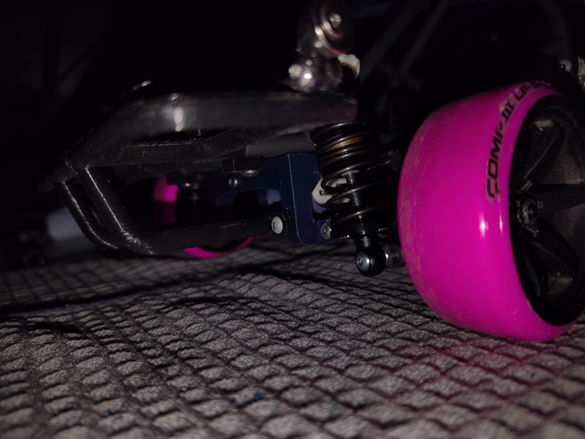
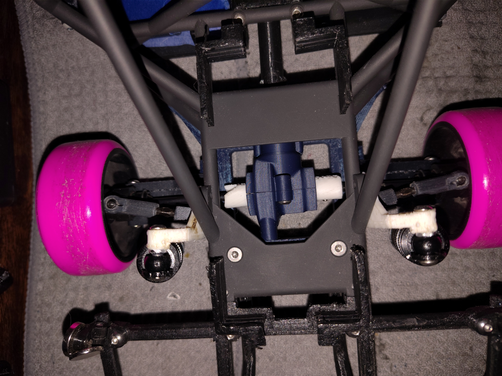
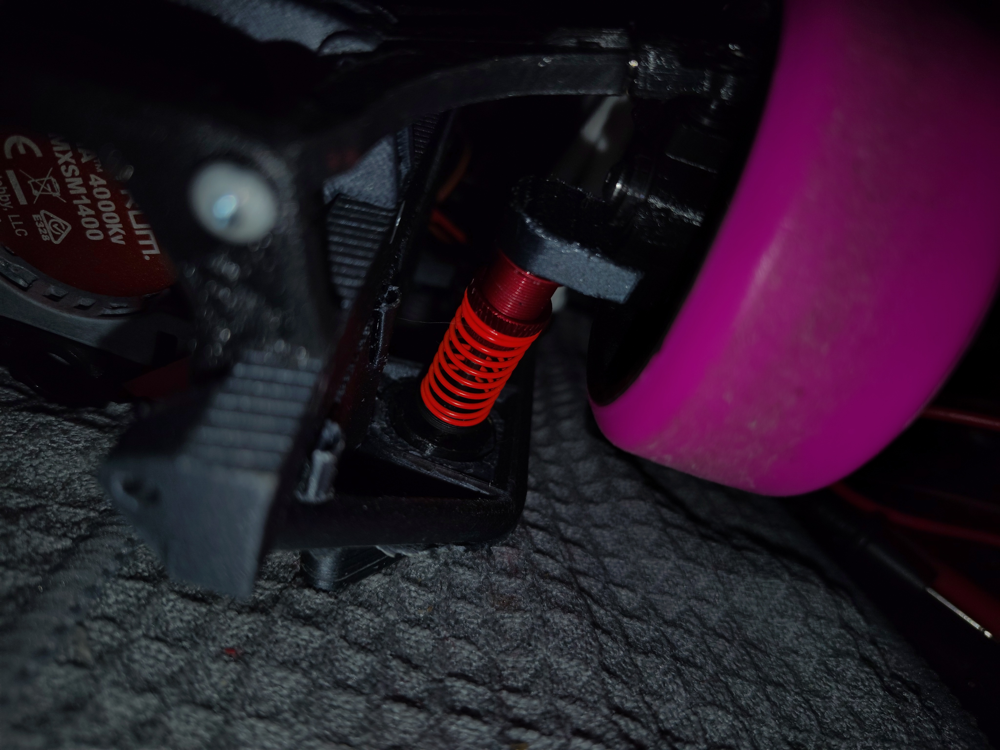
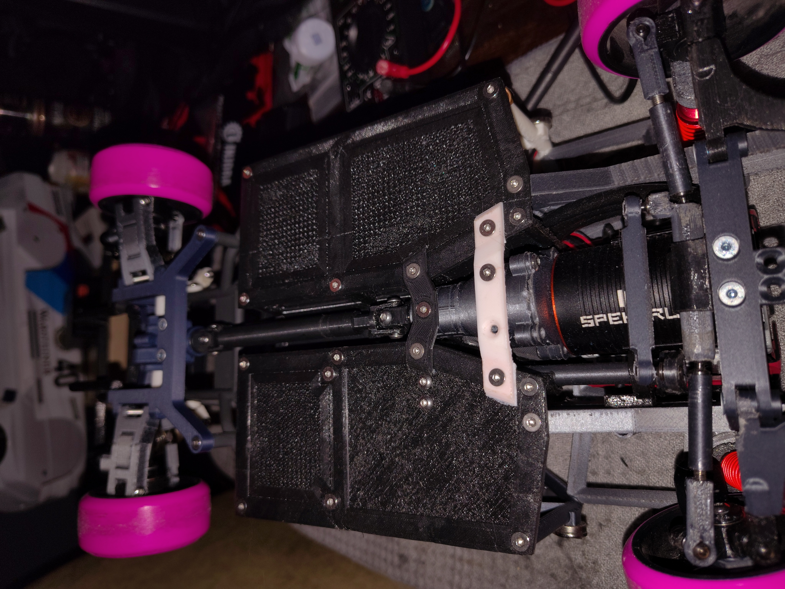

# PortfolioOfLlamas
Engineering Portfolio of 3D prints/files, and projects

# Project: Hestia
## Team 205: Who-Wa-Way
## Team Members:
1. LuYan Tan
1. Ethan Conner
1. Maryam Younan
1. Lana Harkin
## Preparation Date: 1/26/2024
## University: Arizona State University (ASU)
## Class Name: EGR314: Embedded System Design Project II
## Semester: Spring
## Year: 2024
## Professor: Travis Kelley

## Charter:
* Our team's goal is to create a portable weather station to inform the user of the current humidity, temperature, and other weather data. This device will be able to travel across the ground to create a localized weather map using temperature and humidity, connecting to wifi as well as alerting the user of severe weather changes. 
## Mission Statement:
* The primary objective is to create a user-friendly R/C car that can autonomously compile real-time environmental conditions. Additionally, the system will incorporate a feature for manual control. This design will seamlessly integrate temperature and humidity sensors, providing an innovative solution for the ultimate mix between work and play.

## Available at [WhoWaWay](https://WhoWaWay.github.io)

# [User Needs, Benchmarking, and Requirement](/UserNeeds-Benchmarking-Requirements.md)

# [Design Ideation](/Design-Ideation.md)

# [Team Presentation](Presentation.md)

# [Selected Design](/New-Selected-Design.md)

# [Block Diagram](/Block-Diagram.md)

# [Component Selection](/Component-Selection.md)

# [Final Software Implementation](/Final-Software-Implementation.md)

# [Final Hardware Implementation](/Final-Hardware-Implementation.md)

# [System Verification Matrix](/System-Verification.md)

# [Lesson Learned](/Lessons-Learned.md)

# [Recommendation For Future Students](/Recommendations-For-Future-Students.md)

# [Appendix](/Appendix.md)

# Personal Projects
Most of the following are existing models I used to learn best practices for printing. I will make a note of which are my own design as I was refamiliarizing myself with CAD software.

## 1/10 Scale RC Tube Frame
Top View with Electronics
* This was the first major project I undertook, and was the first big stress test for my first 3D printer; the Ender 3. All parts were printed with the original nozzle and bowden tube extruder until I began having quality/durability issues on gears.

Rear Double Wishbone Suspension and Differential
* Apart from the gears, this was the easiest print for this frame. Small issues with the differential mounts breaking upon impacts, changed with smaller layer lines and angled printing.
  

Rear Differential from Above
* While I knew of the inherent weakness of layer lines, printing gears of usable quality was a challenge at first. Many prints were scrapped in order to acheive desired results and my understanding of slicer settings has improved leaps and bounds.
  

Front MacPherson Strut Suspension
* Another initial challenge was acheiving accurate threads and strength across layer lines for the shock covers. The fix at the time was to simply slow down printing and reduce the layer height, for which I now know of additional ways to optain quality parts.
  

Undercarriage 
* As this area is unseen, I took the time to experiment with different infill patterns for the floor and the driveshaft. Similar troubles with gear quality/durability for the first gear reduction. Standard transmission grease has proven a good addition to extend the life of high wear parts.
  

## 1/10 Scale TPU Tires
* Of the many treads I've printed, this most recent batch came out the best. While researching best practices for TPU printing, I came across a high speed profile that produces results on par with the reccommended speeds without taking 19 hours for a single tire. I am not yet satisfied with the flex of this tire, and am beginning experimentation with softer TPU and reduced infill.
  

## Size 540 Brushless DC Motor (In Progress)
Using an online modeling tool, I designed a motor design that should be cheaper and hopefully have more torque than a Spectrum 4500kv size 540 BLDC motor.

## Hotwheels RC
Printing at such a small scale and retaining detail and strength proved a challenge with still, only a 0.4mm nozzle. While not the best results, slowing down, adding a brim and taking the time to do post-processing proved worth it. The subject on the left is fully functional and moves, while the subject on the right has yet to be christened.

## 1/30 Scale Suspension Extenders
This small pair is only 17mm tall and roughly 5mm wide. It extends the initial travel of 25mm to 42mm in height to provide traction in awkward angles. My own design modified from another for more strength, each hole is 1.35mm in diameter and the leg prevents them from swinging too far once extended. 
* According to the RC community, these are referred to as "Flex Blades".
  

This shows the side view of a 1/30 scale RC with the "Flex Blades" attached and the front has a more modest 7mm extension.

## 1/30 Scale Beadlock rims
Surprisingly, with all this time, I've managed to create much more reliable slicer profiles and the hardest part was putting the wheels on.

## Cycloidal Gearbox (Brainstorming)
This particulat gearbox has a -- reduction and seemed a fun challenge to scale down quite a bit to approximately 25mm squared from 55mm squared and attach them to the previous RCs and maybe add some way to "shift" by engaging two in tandem.

